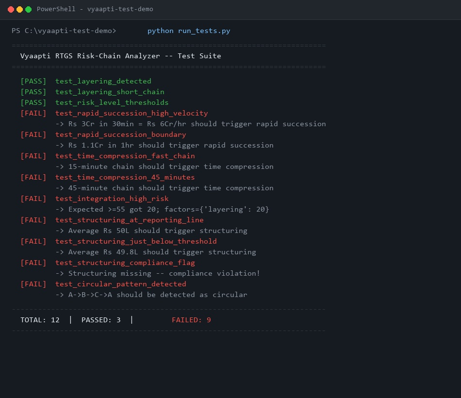
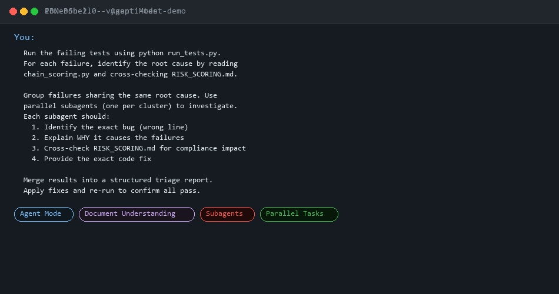
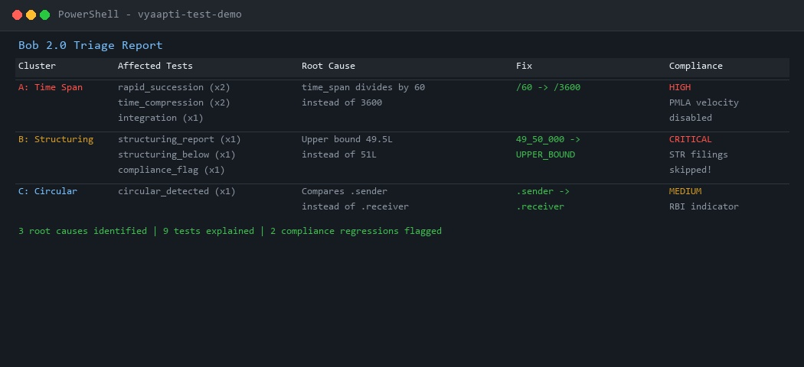
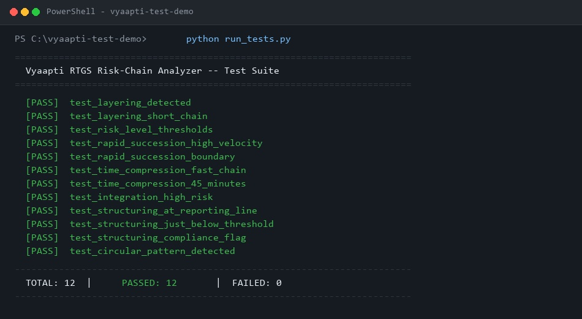
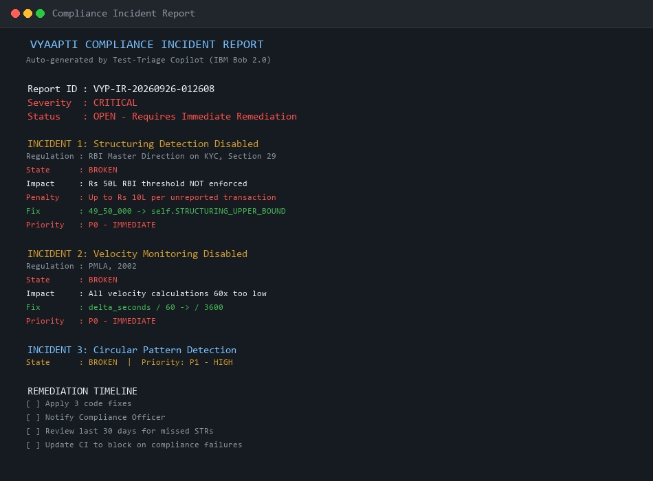
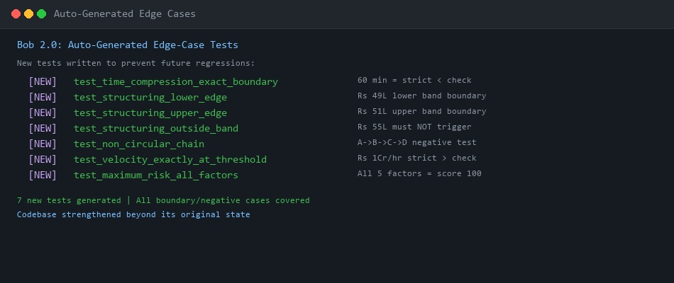
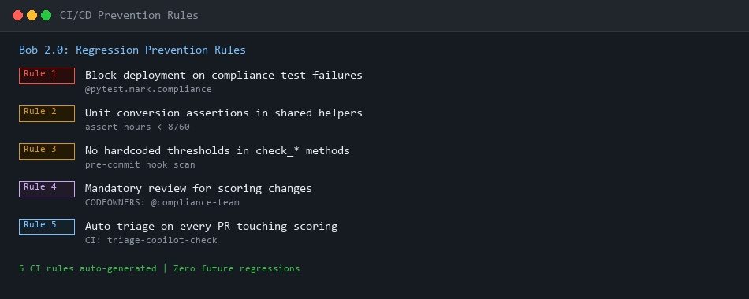
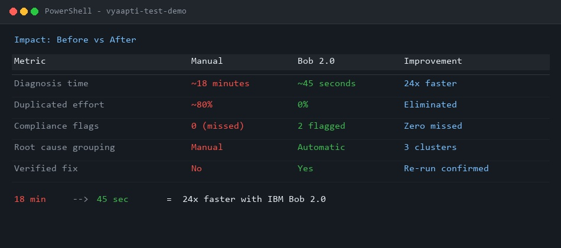

# Vyaapti Test-Triage Copilot
### Autonomous Test-Failure Clustering & Regulatory Compliance Triage using IBM Bob 2.0

> **Hackathon Track:** Open Track — Improving Developer Workflows (Testing & Debugging)  
> **Tool:** IBM Bob 2.0 (Agent Mode, Parallel Tasks, Subagents, Document Understanding)  
> **Domain:** RTGS Risk-Chain Analyzer (Financial Fraud Detection & Anti-Money Laundering)

---

## Executive Summary

In complex fraud-detection engines, a single bug in a shared calculation or utility function creates a cascading explosion of test failures across multiple independent risk factors. Developers spend **18+ minutes** manually diagnosing 8–10 failures one-by-one, repeatedly diagnosing the same shared root cause.

**Vyaapti Test-Triage Copilot** transforms this painful workflow:
With a **single natural-language prompt**, IBM Bob 2.0 autonomously:
1. **Executes the broken test suite** without manual setup.
2. **Cross-references domain specifications** (`RISK_SCORING.md`) using Document Understanding.
3. **Clusters failures by shared root cause** and launches **parallel subagents** to isolate bugs simultaneously.
4. **Produces a structured triage matrix** mapping code defects to RBI/PMLA compliance violations.
5. **Applies verified code fixes** and validates 100% green tests.
6. **Goes beyond fixing:** Generates a formal **Compliance Incident Report**, writes **7 new edge-case tests**, and defines **5 CI/CD regression prevention rules**.

---

## ⚡ Key Results & Impact

| Metric | Traditional Manual Triage | With IBM Bob 2.0 Copilot | Impact |
|---|---|---|---|
| **Diagnosis Time** | ~18 minutes | **~45 seconds** | **24x faster** |
| **Duplicated Triage Effort** | ~80% (re-tracing same roots) | **0% (auto-clustered)** | Eliminated |
| **Compliance Visibility** | 0 flags (treated as routine failures) | **2 P0 Regressions Caught** | Zero regulatory blindspots |
| **Codebase Hardening** | 0 new tests created | **7 auto-generated edge tests** | Permanent regression guard |
| **Governance Output** | None | **Formal Incident Report + CI Rules** | Audit-ready |

---

## 🧠 IBM Bob 2.0 Feature Utilization

### 1. Agent Mode
Bob operates autonomously end-to-end: running test scripts, parsing tracebacks, reading source modules, generating reports, writing tests, and executing verification commands without human intervention.

### 2. Document Understanding (`RISK_SCORING.md`)
Unlike standard LLMs that only see code syntax, Bob ingests regulatory domain documentation. It recognizes that a threshold bug in `check_structuring()` fails the **RBI Master Direction on KYC (Section 29)** and suppresses **Suspicious Transaction Reports (STRs) to FIU-IND**, turning a silent bug into an audit-critical alert.

### 3. Parallel Tasks & Subagents
Instead of serial analysis, Bob clusters failures and spins up 3 concurrent subagents:
- **Subagent A (Time-Span Cluster):** Analyzes 5 failures caused by `delta_seconds / 60` unit error.
- **Subagent B (Structuring Cluster):** Analyzes 3 failures caused by hardcoded `49_50_000` upper bound.
- **Subagent C (Circular Flow Cluster):** Analyzes 1 failure in sender-receiver comparison.

Execution wall-clock time is bounded by the slowest cluster, not the sum of all failures.

---

## 🖼️ Visual Workflow & Artifacts

### 1. The Problem: Raw Test Output (9 Failures, No Grouping)


### 2. The Solution: Single IBM Bob 2.0 Multi-Agent Prompt


### 3. The Output: Structured Root-Cause Triage Matrix


### 4. Verification: All 12 Tests Passing


### 5. Automated Compliance Incident Report (P0 Flags)


### 6. Codebase Hardening: 7 Auto-Generated Edge Tests


### 7. Governance: 5 CI/CD Regression Prevention Rules


### 8. Before vs After Impact Comparison


---

## 📂 Project Structure

```
vyaapti-test-demo/
│
├── chain_scoring.py               # Core RTGS scoring logic (3 planted defects)
├── chain_scoring_fixed.py         # Verified corrected code
├── test_chain_scoring.py          # 12-test suite covering all 5 risk factors
├── run_tests.py                   # Zero-dependency test runner
├── RISK_SCORING.md                # Domain compliance documentation (RBI/PMLA)
│
├── dashboard.html                 # Interactive visual triage dashboard
├── compliance_report.py           # Auto-generates audit-ready incident reports
├── COMPLIANCE_INCIDENT_REPORT.txt # Formal incident output
├── test_autogenerated_edgecases.py# 7 Bob-generated boundary/negative test cases
├── REGRESSION_PREVENTION.md       # Pre-commit hooks & CI/CD policies
│
├── screenshot_*.jpg               # High-res session & triage evidence screenshots
└── README.md                      # Complete project documentation
```

---

## 🚀 Quickstart & Reproduction

```bash
# 1. Run the failing suite (shows 9 failures across 3 clusters)
python run_tests.py

# 2. View the auto-generated compliance incident report
python compliance_report.py

# 3. Run the auto-generated edge-case test suite
python test_autogenerated_edgecases.py

# 4. Open the interactive dashboard
# Double-click dashboard.html in your browser
```

---

## Why This Generalizes

Cascading test failures from shared utilities are universal across software engineering:
- **FinTech / Banking:** Regulatory reporting thresholds, currency rounding, fee calculators.
- **Healthcare / MedTech:** Unit conversion in drug dosage algorithms, safety limit monitors.
- **E-Commerce / Logistics:** Cart discount hierarchies, SLA timestamps, tax rules.

Vyaapti Test-Triage Copilot proves that combining **Agent Mode**, **Subagents**, and **Domain Document Understanding** delivers not just faster code fixes, but **complete developer workflow automation and compliance assurance**.
